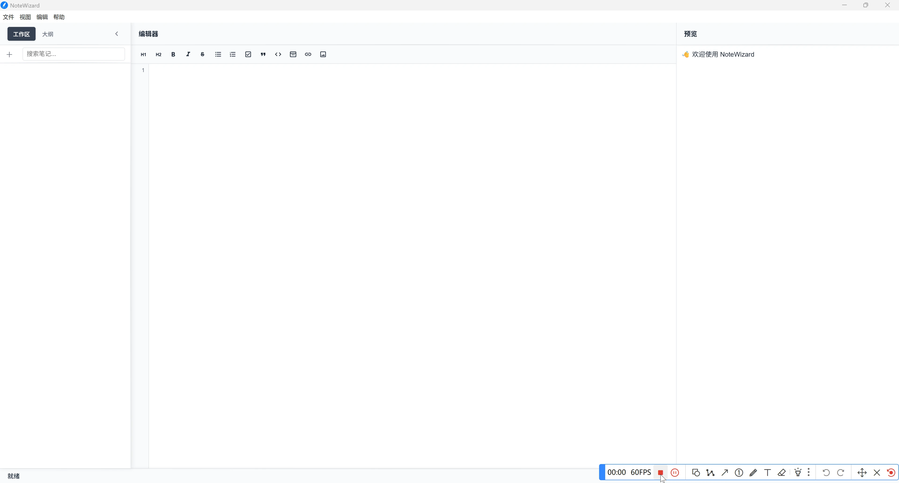

  
  <h2> NoteWizard </h2>
  
一款基于Electron开发的现代化跨平台笔记应用，数据本地存储，让数据始终安全可控。

  

## 功能特点
- **Markdown支持**：实时预览 Markdown 渲染效果
- **跨平台**：支持 Windows、macOS 和 Linux 系统
- **本地存储**：所有笔记安全保存在本地
- **主题切换**：随心切换您偏好的界面主题
- **极简界面**：简单纯粹无广告
- **国际化**：支持19种语言及地区设置

## 界面预览
**NoteWizard 快速开始**  

**NoteWizard 主界面**  

**NoteWizard 首选项界面**  

**NoteWizard 关于界面**  

## 支持平台

本项目当前支持以下操作系统与架构：
| 平台 | 最低支持版本 | 架构 | 安装包格式 | 备注 |
|------|-------------|------|-----------|------|
| **Windows** | Windows 10 及以上 | x64 | `.exe` | 不支持 Windows XP/Vista/7/8/8.1 |
| **macOS** | macOS Big Sur (11.0) 及以上 | x64,arm64 | `.dmg`, `.zip` | 支持 Intel 和 Apple Silicon |
| **Linux** | Ubuntu 18.04+ / Debian 10+ / Fedora 32+ 及其他主流Linux版本 | x64 | `.deb`,`.rpm`,`.AppImage` | 理论支持使用 glibc 2.28+ 的Linux发行版 |

>  **提示：** 请根据对应平台下载相应安装包，并确保系统满足最低版本要求。

## 下载安装

使用 `GitHub Workflows` 自动构建多平台安装包，请根据您的操作系统选择对应的安装包：

- [下载最新版本](https://github.com/jetyu/NoteWizard/releases/latest) 

## 快速开始

### 环境要求

- Node.js (v20 或更高版本)
- npm (v10 或更高版本)
- Git (用于克隆仓库)

## 主要依赖

- **Electron** - 使用 JavaScript, HTML 和 CSS 构建跨平台桌面应用
- **CodeMirror** - 功能丰富的代码编辑器
- **Marked** - Markdown 解析器和编译器

## 参与贡献

我们非常欢迎和感谢所有贡献！无论是报告 Bug、讨论功能，还是提交代码，您的支持都是项目前进的动力。

1. Fork 项目
2. 创建功能分支 (`git checkout -b feature/新功能`)
3. 提交更改 (`git commit -m '添加新功能'`)
4. 推送到分支 (`git push origin feature/新功能`)
5. 提交 Pull Request

## 开源协议

本项目采用 MIT 开源协议，详情请参阅 `LICENSE` 文件。

## 致谢

感谢以下开源项目的支持：
- [Electron](https://www.electronjs.org/)
- [CodeMirror](https://codemirror.net/)
- [Marked](https://marked.js.org/)
- 所有为项目做出贡献的开发者

---

### 成长轨迹
  
