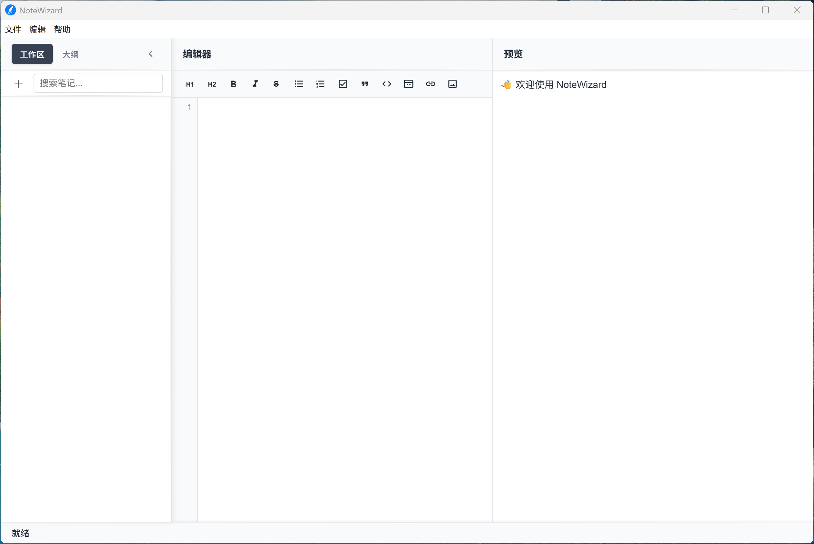
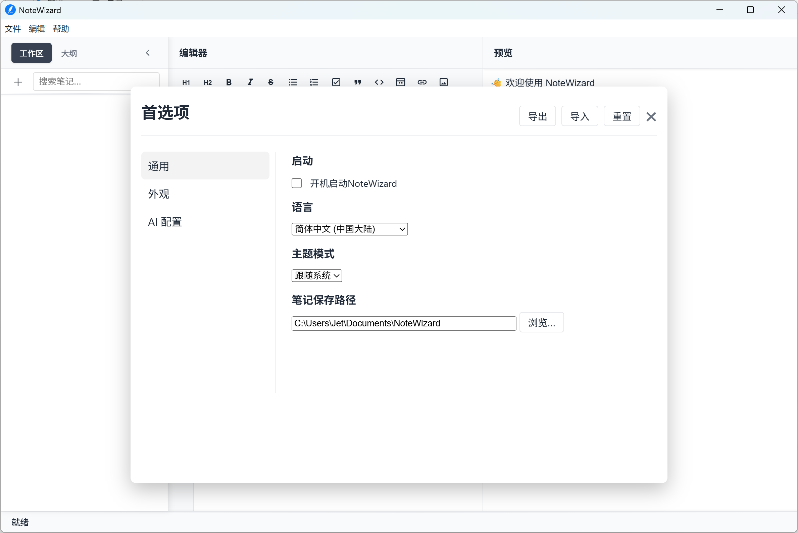
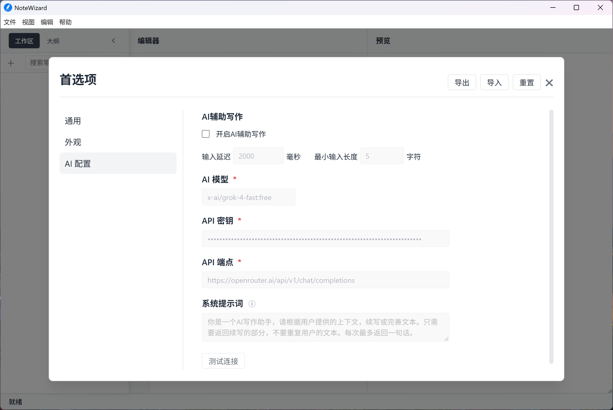
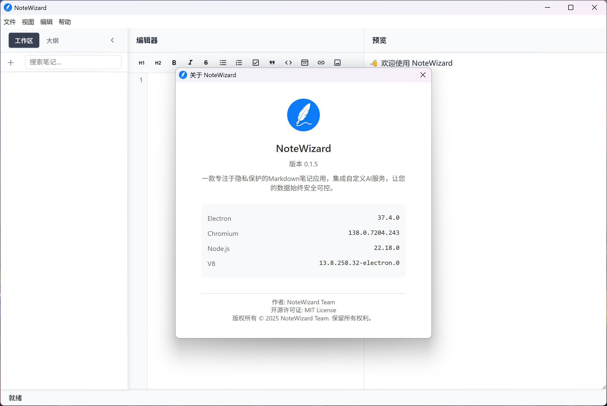

**Language / 语言:** [English](README_EN.md) | [简体中文](README.md)

  
  <h2> NoteWizard </h2>
  
A modern cross-platform note-taking application built with Electron, featuring local data storage for complete security and control.

  

## Features
- **Minimalist Interface**: Simple, clean, and ad-free
- **Cross-Platform**: Supports Windows, macOS, and Linux
- **Markdown Support**: Real-time Markdown preview and rendering
- **AI-Powered Writing Assistant**: Intelligent writing assistance for enhanced productivity
- **Local Storage**: All notes stored locally for easy data import/export
- **Internationalization**: Supports 19 languages and regional settings

## Screenshots
**NoteWizard Quick Start (v0.2.6)**  

**NoteWizard Main Interface**  

**NoteWizard Preferences**  

**NoteWizard About**  

## Supported Platforms

Current supported operating systems and architectures:
| Platform | Supported Versions | Architecture | Package Format | Notes |
|----------|-------------------|--------------|----------------|-------|
| **Windows** | Windows 10 and above | x64 | `.exe` | Windows XP ~ 8.1 not supported |
| **macOS** | macOS Big Sur (11.0) and above | x64 / arm64 | `.dmg`, `.zip` | Supports Intel and Apple Silicon |
| **Linux** | Ubuntu 18.04 / Debian 10 / Fedora 32 and above | x64 | `.deb`, `.rpm`, `.AppImage` | Compatible with mainstream Linux distributions |

>  **Note:** Please download the appropriate package for your platform and ensure your system meets the minimum version requirements.

## Download & Installation
Built automatically using `Workflows`, click to download the latest package for your platform:

### Windows

### macOS

**Intel Chip**

**Apple Silicon**

### Linux

**DEB Package (Debian/Ubuntu)**  

**RPM Package (Fedora/RHEL)**  

**AppImage (Universal)**  

>   [View All Releases](https://github.com/jetyu/NoteWizard/releases/latest)

## Quick Start

### Requirements

- Node.js (v20 or higher)
- npm (v10 or higher)
- Git (for cloning the repository)

## Main Dependencies

- **Electron** - Build cross-platform desktop apps with JavaScript, HTML, and CSS
- **CodeMirror** - Feature-rich code editor
- **Marked** - Markdown parser and compiler

## Contributing

We welcome and appreciate all contributions! Whether it's reporting bugs, discussing features, or submitting code, your support drives the project forward.

1. Fork the project
2. Create a feature branch (`git checkout -b feature/AmazingFeature`)
3. Commit your changes (`git commit -m 'Add some AmazingFeature'`)
4. Push to the branch (`git push origin feature/AmazingFeature`)
5. Open a Pull Request

## License

This project is licensed under the MIT License. See the `LICENSE` file for details.

## Acknowledgments

Thanks to the following open source projects:
- [Electron](https://www.electronjs.org/)
- [CodeMirror](https://codemirror.net/)
- [Marked](https://marked.js.org/)

---

### Star History
  
